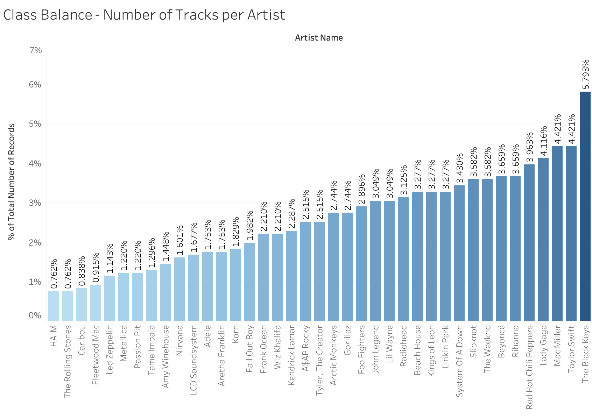
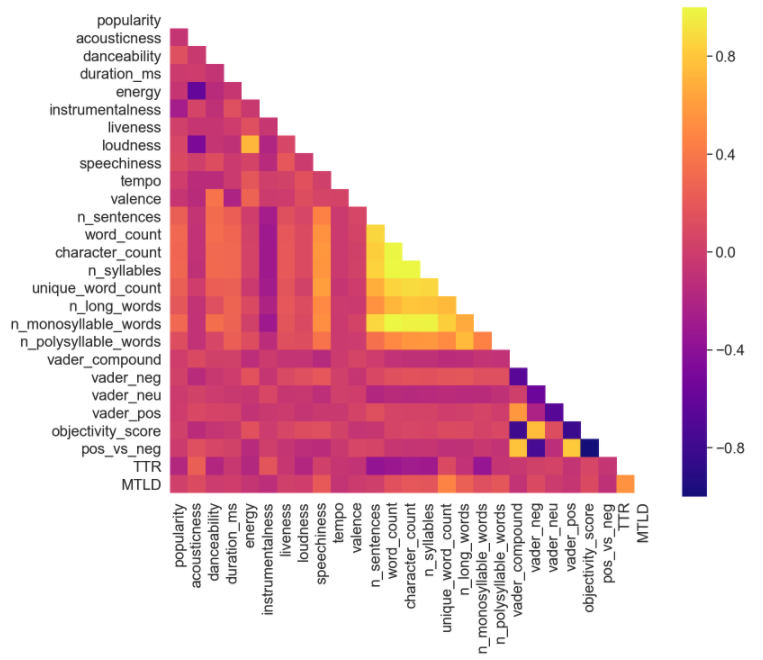
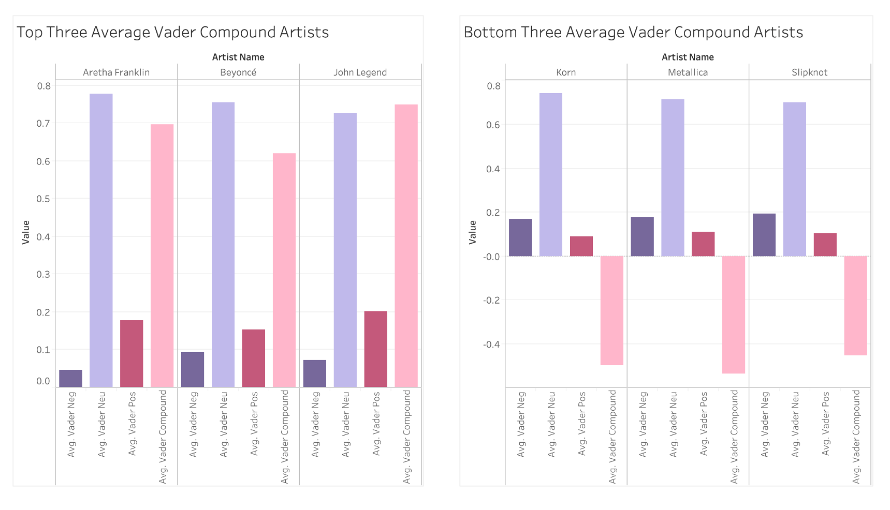
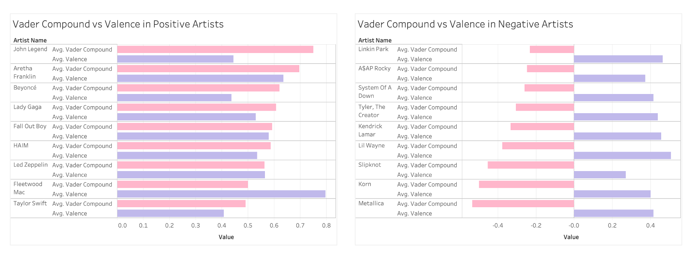
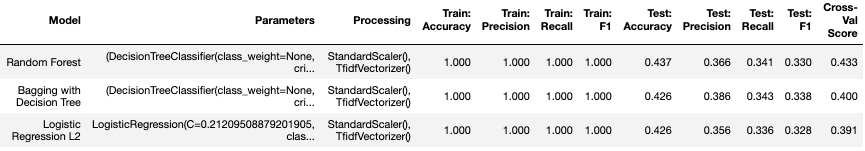
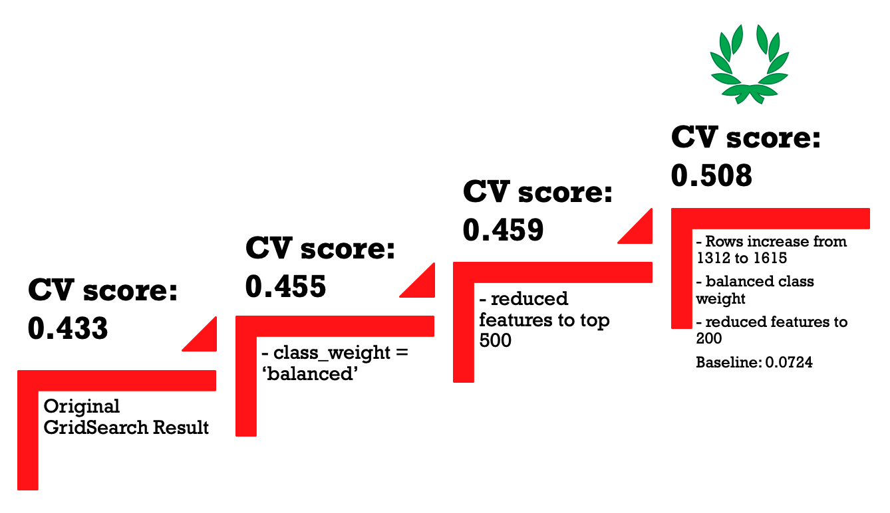
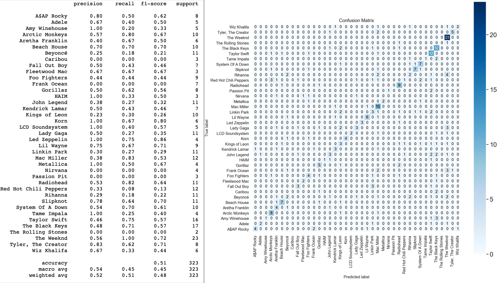
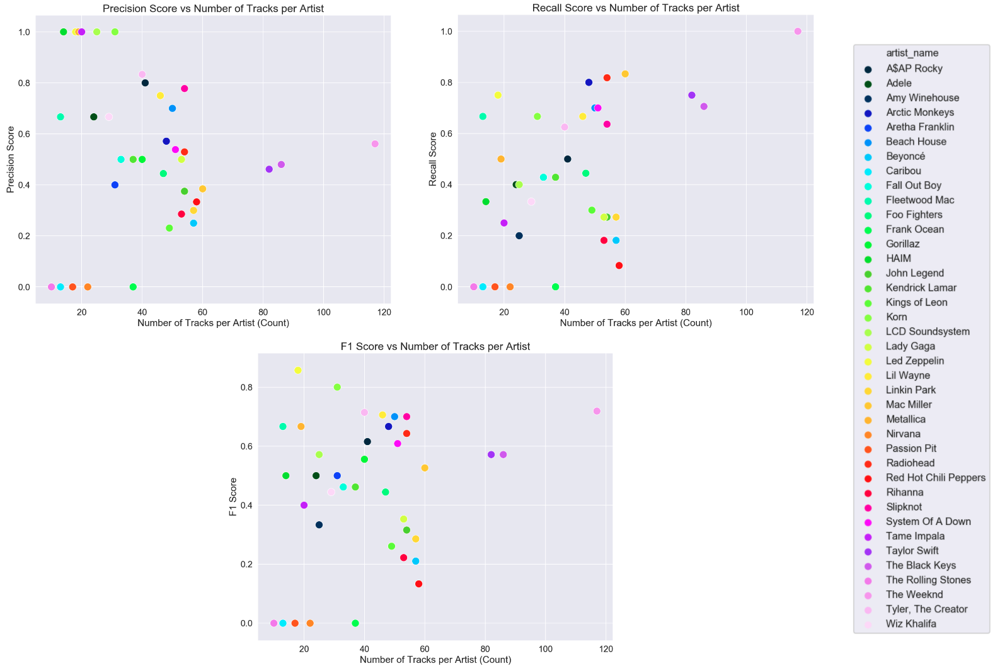

# Music Artist Predictor

**General Assembly | Data Science Immersive | Capstone Project**

***

ML model that is able to predict the music artist of a track based on the song's Spotify music features and Genius lyrics.

## Table of Contents

* [Problem Statement](#Problem-Statement)
* [Goals](#Goals)
* [Methodology](#Methodolgy)
* [Python Libraries](#Python-Libraries)
* [Data Collection](#Data-Collection)
* [Data Preparation](#Data-Preparation)
* [Exploratory Data Analysis](#Exploratory-Data-Analysis)
* [Model Selection](#Model-Selection)
* [Model Optimisation](#Model-Optimisation)
* [Results](#Results)
* [Further Steps](#Further-Steps)

## Problem Statement

Can we predict a music artist by his/her songs' spotify music features, popularity score and lyrics?

## Goals

1. Create a multinominal classification model that is able to predict the music artist by the artists' songs given the songs' spotify audio features and lyrics of the song.
2. Make predictions about which features mostly affect the identity of music artist. Is his/her style based in the lyrics or the music itself?
3. Evaluate the model by testing it on unseen data and producing classification report, confusion matrix, ROC curve and other evaluation metrics.

## Methodology

1. Select artists from a Spotify Dataset published on Kaggle.

2. Retrieve lyrics from artists' songs through Genius API wrapper called lyricsgenius by johnwmillr.

3. Establish SQL database and merge data.

4. Clean data of missing values, duplicates and other anomalies.

5. Perform sentimental analysis and other NLP analysis to derive NLP-based continous features.

6. Prepare data for modelling: train-test-split (80/20),CountVectorizer/TfidfVectorizer, standardisation, 

7. Select a model by testing different classifiers.

8. Optimise model.

9. Evaluate model with Accuracy, Precision and Recall.

10. Outline results, limitations and future steps.
  

## Python Libraries

[Pandas](https://pandas.pydata.org/), [Numpy](https://numpy.org/), [scikit-learn](https://scikit-learn.org/stable/), [textacy](https://chartbeat-labs.github.io/textacy/build/html/index.html), [lexical diversity](https://pypi.org/project/lexical-diversity/), [VaderSentiment](https://github.com/Holek/vader_sentiment), [Matplotlib](https://matplotlib.org/), [Seaborn](https://seaborn.pydata.org/), [Postgres](https://postgresapp.com/), [Regex(re)](https://docs.python.org/3/library/re.html#module-re)

## Data Collection

Data was collected from [Spotify Track Dataset](https://www.kaggle.com/zaheenhamidani/ultimate-spotify-tracks-db) sourced from Kaggle and from Genius Lyrics website using the [lyricsgenius](https://github.com/johnwmillr/LyricsGenius) wrapper by johnwmillr utilising Genius APIs and BeautifulSoup webscraping.

## Data Preparation

**Data Cleaning & Processing**

* Removing duplicated entries

* Adjust artist name spellings of the Genius Data to the Spotify spelling

* Removing entries containing a featuring artist with the primary artist 

* Removing artist which aren't part of the target classes

* Some of the processing steps involved for feature engineering of the lextical diversity^, textacy stats^^ or sentiment analysis^^^ 
or CountVectorization(!) or TfidfVectorization(!!) of the Lyrics data:

    1. Removing elements such as [Chorus] or [Intro] added by the Lyrics Genius Website - utilising Regex. (all)

    2. Conversion to lowercase - utilising Python (!, !!)

    3. Parsing - performed by *textacy* or CountV/TfidifV (all)

    4. Tokenization - performed by *textacy* or skicit-learn's CountV and TfidfV classes (all)

    5. Lemmatization performed by *lexical diversity* and *Vader* (^,^^^)

***

**Features Engineered (excl. any CountVectorizer/TfidfVectorizer corpus)**

* Lexical diversity features Token-Type-Ratio (TTR) and Measure of Textual Lexical Diversity (MTLD) were engineered with [lexical diversity library](https://pypi.org/project/lexical-diversity/)

* NLP features number of sentences (n_sentences), word count (word_count), character count (character_count), number of syllables (n_syllables), unique word count (unique_word_count), number of long words (n_long_words), number of monosyllable words (n_monosyllable_words) and number of polysyllable words (n_polysyllable_words) were created using the [textacy library](https://chartbeat-labs.github.io/textacy/build/html/index.html)

* Sentiment Analysis and feature creation of vader_compound, vader_pos, vader_neu, vader_neg, objectivity_score and pos_vs_neg was performed using [VaderSentiment library](https://github.com/cjhutto/vaderSentiment).

  

Variable | Description | Data Type
--- | :--- | :--- 
artist_name | The artist or band name of the song. | string object 
track_name | The track name is simply title of the song. | string object 
track_id | The spotify ID number which at the time the dataset was collected functioned as the uri but might not match with current uris and IDs. | string object 
popularity | Generally speaking, songs that are being played a lot now will have a higher popularity than songs that were played a lot in the past. Duplicate tracks (e.g. the same track from a single and an album) are rated independently. Artist and album popularity is derived mathematically from track popularity. Note that the popularity value may lag actual popularity by a few days: the value is not updated in real time. | int64 
acousticness | A confidence measure from 0.0 to 1.0 of whether the track is acoustic. 1.0 represents high confidence the track is acoustic. | float64 
danceability | Danceability describes how suitable a track is for dancing based on a combination of musical elements including tempo, rhythm stability, beat strength, and overall regularity. A value of 0.0 is least danceable and 1.0 is most danceable. | float64 
duration_ms | The duration of the track in milliseconds. | int64 
energy | Energy is a measure from 0.0 to 1.0 and represents a perceptual measure of intensity and activity. Typically, energetic tracks feel fast, loud, and noisy. For example, death metal has high energy, while a Bach prelude scores low on the scale. Perceptual features contributing to this attribute include dynamic range, perceived loudness, timbre, onset rate, and general entropy. | float64 
instrumentalness | Predicts whether a track contains no vocals. “Ooh” and “aah” sounds are treated as instrumental in this context. Rap or spoken word tracks are clearly “vocal”. The closer the instrumentalness value is to 1.0, the greater likelihood the track contains no vocal content. Values above 0.5 are intended to represent instrumental tracks, but confidence is higher as the value approaches 1.0. | float64 
key | The estimated overall key of the track. Integers map to pitches using standard Pitch Class notation . E.g. 0 = C, 1 = C♯/D♭, 2 = D, and so on. If no key was detected, the value is -1. | string object 
liveness | Detects the presence of an audience in the recording. Higher liveness values represent an increased probability that the track was performed live. A value above 0.8 provides strong likelihood that the track is live. | float64 
loudness | The overall loudness of a track in decibels (dB). Loudness values are averaged across the entire track and are useful for comparing relative loudness of tracks. Loudness is the quality of a sound that is the primary psychological correlate of physical strength (amplitude). Values typical range between -60 and 0 db. | float64 
mode | Mode indicates the modality (major or minor) of a track, the type of scale from which its melodic content is derived. Major is represented by 1 and minor is 0. | string object 
speechiness | Speechiness detects the presence of spoken words in a track. The more exclusively speech-like the recording (e.g. talk show, audio book, poetry), the closer to 1.0 the attribute value. Values above 0.66 describe tracks that are probably made entirely of spoken words. Values between 0.33 and 0.66 describe tracks that may contain both music and speech, either in sections or layered, including such cases as rap music. Values below 0.33 most likely represent music and other non-speech-like tracks. | float64 
tempo | The overall estimated tempo of a track in beats per minute (BPM). In musical terminology, tempo is the speed or pace of a given piece and derives directly from the average beat duration. | float64 
time_signature | An estimated overall time signature of a track. The time signature (meter) is a notational convention to specify how many beats are in each bar (or measure). | string object 
valence | A measure from 0.0 to 1.0 describing the musical positiveness conveyed by a track. Tracks with high valence sound more positive (e.g. happy, cheerful, euphoric), while tracks with low valence sound more negative (e.g. sad, depressed, angry). | float 64 
release_year | The date the track/song was released. | string object - has to be changed to datetime 
spotify_uri | Genius' record of spotify uri for a track. | string object 
lyrics | Web scrapped lyrics from genius.com website. | string object
lyrics_processed | Lyrics processed for NLP analysis | string object
n_sentences | Number of sentences in track extracted by textacy. | int64
word_count | Number of words in track, including numbers + stop words but excluding punctuation extracted by textacy. | int64
character_count | Character count per track extracted by textacy. | int64
n_syllables | Number of syllables per track extracted by textacy. | int64
unique_word_count | Number of unique (lower-cased) words in track extracted by textacy. | int64
n_long_words | Number of words in track with 7 or more characters extracted by textacy. | int64
n_monosyllable_words | Number of words in track with 1 syllable only. | int64
n_polysyllable_words | Number of words in doc with 3 or more syllables extracted by textacy. Note: Since this excludes words with exactly 2 syllables, it’s likely that n_monosyllable_words + n_polysyllable_words != n_words. | int64
vader_compound | VaderSentiment Library: The compound score is computed by summing the valence scores of each word in the lexicon, adjusted according to the rules, and then normalized to be between -1 (most extreme negative) and +1 (most extreme positive). This is the most useful metric if you want a single unidimensional measure of sentiment for a given sentence. Calling it a 'normalized, weighted composite score' is accurate. | float64
vader_neg | VaderSentiment Library: compound score >= 0.05. The pos, neu, and neg scores are ratios for proportions of text that fall in each category (so these should all add up to be 1... or close to it with float operation). These are the most useful metrics if you want multidimensional measures of sentiment for a given sentence. | float64
vader_neu | VaderSentiment Library: (compound score > -0.05) and (compound score < 0.05). The pos, neu, and neg scores are ratios for proportions of text that fall in each category (so these should all add up to be 1... or close to it with float operation). These are the most useful metrics if you want multidimensional measures of sentiment for a given sentence. | float64
vader_pos | VaderSentiment Library: compound score <= -0.05. The pos, neu, and neg scores are ratios for proportions of text that fall in each category (so these should all add up to be 1... or close to it with float operation). These are the most useful metrics if you want multidimensional measures of sentiment for a given sentence. | float64
objectivity_score | objectivity = 1. - (vader_pos + vader_neg). | float64
pos_vs_neg | pos_vs_neg = vader_pos - vader_neg. | float64
TTR | A type-token ratio (TTR) is the total number of unique words (types) divided by the total number of words (tokens) in a given segment of language. This has been performed the classical way where words have not been lemmatised using lexical diversity library.  | float64
MTLD | Calculates Measure of Textual Lexical Diversity (MTLD) based on McCarthy and Jarvis (2010) using lexical diversity library. The higher this score is the more complex is the text. | float64

## Exploratory Data Analysis

Please refer to the Exploratory Data Analysis Notebook and my Public Tableau Profile for further insights. This is a summarised EDA.

### Class imbalance

The dataset on which the original modeling was performed on is a dataset of 1312 rows containing 39 classes (music artists). Their representation in the dataset is here illustrated in percentages. The majority class which determines the baseline of this dataset is The Black Keys. They occupy 5.793% of the dataset which translates to baseline of 0.058. This graph illustrates that there is class imbalance which might influence the predictability of the different classes. (Graph created with Tableau Desktop)

### Correlation

This correlation matrix illustrates the correlation between all continuous variables in the 1312 rows dataset (Similar pattern has been observed in the 1615 rows dataset). As expected there is a strong correlation between the text statistics and also within the vader sentiment analysis. A high colinearity is therefore expected between those features. It is also intersting to note that there seems to be a slight correlation between some of the music feature variables such as popularity, dancability or duration_ms with some of the text statistics such as word_count or unique_word_count. (Graph created with Tableau Desktop)

### Sentiment Analysis

**VaderSentiment Scores filtered on Mean Vader Compound of each Music Artist**

The two graphs illustrate the most positive and most negative artists based on their vader compound scores of the 1312 rows dataset (filtered on vader_compound). Positive artists usually have higher average vader positive scores than vader negative scores while negative artists usually exibit the vice versa. Vader neutral words are always represented highest in any text as this usually describes non-biased words also such as 'the', 'and' or 'is'. (Graph created with Tableau Desktop)
  
**Vader compound in Relation to Spotify's Musical Valence**

Analysing the mean vader compound scores of individual artists with their mean valence scores, it suggests that within positive vader compound artists the musical valence have high scores (mostly above 0.4). The negative vader compound artists have mostly valence scores below 0.5. As Spotify's valence is only measured from 0-1, it is important to note that this data representation is not standardised, which would allow a clearer representation. (Graph created with Tableau Desktop)

*Please see Exploratory Data Analysis Notebook for full seaborn/matplotlib visualisations.*

## Model Selection

**Baseline:** 0.058

* Modeling was performed on previously engineered features and lyrics, which were processed either through the use of scikit-learn's CountVectorizer (CountV), taking word counts, or TfidfVectorizer (TfidfV), where rare words are weighted more than common words.

* For both, CountV and TfidfV, a corpus of 1000 features and n grams with a range of 1 to 3 was created. Stop words were removed, but words were not stemmed and lemmatised, due to the use of slang in many tracks.

* Engineered features and CountV/TfidfV matrices were standarized using scikit-learn's StandardScaler() class.

* Modeling on PCA data was performed but had low scores and was therefore excluded from the testing process. 

### Preliminary Model Testing

First only four models (KNN, Logistic Regression, Random Forest, and Support Vector Machines) were tested with a GridsearchCV using only a few parameters per model on the engineered features and the lyrics processed with either scikit-learn's CountVectorizer or TfidfVectorizer.

***

**Preliminary findings**

* Model testing on the features and <ins>CountVectorized lyrics</ins> indicated Logistic Regression and Random Forest models yielded high cross validation scores of 0.302 and 0.433, respectively. 

* Model testing on the features and <ins>TfidfVectorized lyrics</ins> indicated Logistic Regression and Random Forest models yielded high cross validation scores of 0.399 and 0.398, respectively.

### Large Scale Model Testing

The large-scale model training was performed with TfidfV-engineered lyrics and the other features (see [Data Preparation](##Data-Preparation)).

Following a thourough GridSearchCV Procedure with multiple classification models (see Table below), it was found that the Random Forest Classifier was performing the best out of the <ins>16 models</ins> tested.

## Model Optimisation

* Original CV score: 0.433
* Ran each optimisation step with another Gridsearch in case the preferences shifted.

1. Changed class weight to balanced -  CV score: 0.455
2. Cut down on features by choosing the first 500 most important features - CV score: 0.459
3. Enriched the data from 1312 rows to 1615 rows (baseline: 0.0724, balanced class weight, and reduced features to top 200) - CV score: 0.508

## Results

**GridsearchCV: Random Forest**

* Achieved an optimal cross-validation score of **0.433**.

* Feature importance, based on coefficient absolute number, showed that popularity, loudness, duration_ms, acousticness, unique_word_count, energy etc.

***

**Optimization of Random Forest Model:**

* Achieved optimal cross-validation score of **0.508**.

* Feature importance indicated popularity, loudness, acousticness and unique_word_count (etc.) to have the highest impact on artist prediction.

* It is interesting to note that the order of type of features that influence the class prediction seems to be music features, lexical diversity, text statistics, sentiment and then frequency of specific words.

***

**Evaluation:**

* Accuracy score indicates that the model is able to predict the correct class in about 50% of the cases.

* Macro precision score indicates the ratio of correctly predicted positive observations to the total predicted positive observations. About 54% of the positively predicted artists are correctly predicted.

* Macro Recall/Sensitivity score outlines that 45% of true positive observations were detected as positive. The model misses to detect 55% as true positives.

* F1 score, a combination of the precision and recall score, was determined to be 45%. 
  

  
* Classes with a higher representation achieve higher accuracy, precision and recall scores. This is a strong indication that the model has a bias.

* Evaluating the predictive performance of the random forest model, the ROC curve was plotted for each class and the model's micro and macro ROC curves. Area's under the curves (AUCs) illustrated that the model has a strong ability to distinguish between different classes.

* Precision-recall curves plot the positive predictive value (PPV, y-axis) against the true positive rate (TPR, x-axis). Plotting the micro precision-recall curve of this multiclass model produced a AUC of 0.54. This suggests that the model is only able to have a high recall at a low precision.

* Feature importance indicated popularity, loudness, acousticness and unique_word_count (etc.) to have the highest impact on artist prediction.

* It is interesting to note that the order of type of features that influence the class prediction seems to be music features, lexical diversity, text statistics, sentiment and then frequency of specific words.

***

**Limitations:**

* Kaggle dataset with choices of songs per artists
* Genius servers timeout frequently
* Small dataset
* Some artists have few songs
* Can only be applied to trained artists not unseen artists
* Slight class imbalance favoured majority class predictions

* Risk: Overfitting on training data

***

**Random Forest Classifier: Pros and Cons**

Pros
* Decorrelates trees (relative to bagged trees), which is especially useful when there is a lot of correlation
* Reduced variance in comparison to regular decision tree
* Has the ability to address class imbalance by using the balanced class weight flag
* Scales to large datasets

Cons
* Not as easy to visually interpret
* Long computation time when used in GridSearch
* Tends to overfit on the training data but is claimed to not be susceptible to that

## Future Steps

* Model NLP and numeric features separately and later join them together
* Collect more data to increase statistical significance, enrich dataset and produce a stronger model
* Perform statistical testing on features before modeling, to exclude insignificant features (e.g. with Statsmodel)
